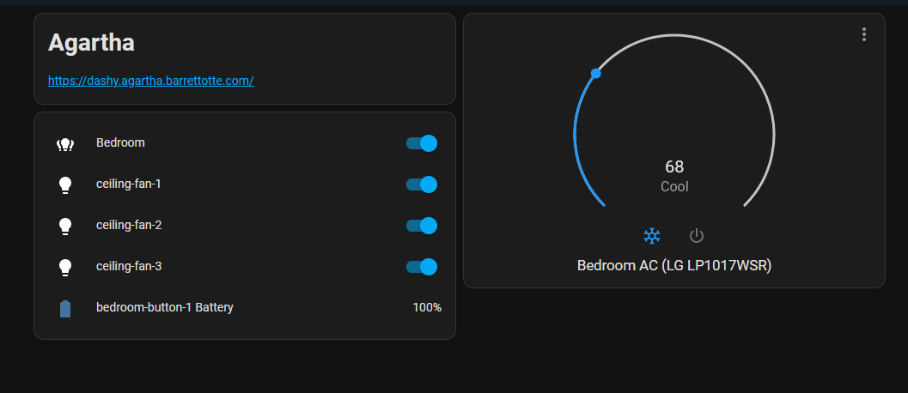

# smarter-ac-unit

Making my AC unit a little smarter with MQTT and Home Assistant

## Summary

Uses Home Assistant, MQTT, and infrared codes to control parts of my AC unit that I care about. 
It can do the following:

- Set temperature between 60°F-86°F, defaulting to 70°F
- Toggle power - off, on (cool mode)
- Change fan speed - low, high



I also added a manual sync button to my circuit to allow resyncing both Home Assistant and the AC unit
back to the state stored on the ESP8266.
This solves any rare problems where states get out of sync and start behaving strangely.

## Infrastructure

### MQTT Broker

Used Eclipse Mosquitto for my MQTT broker, I used Docker to run it.

```yml
# docker-compose.yml

mosquitto:
  container_name: mosquitto
  image: eclipse-mosquitto:2
  ports:
    - '1883:1883' # MQTT
    - '9011:9011' # MQTT over websocket
  volumes:
  - /etc/timezone:/etc/timezone:ro
  - /etc/localtime:/etc/localtime:ro
  - ./mosquitto/mosquitto.conf:/mosquitto/config/mosquitto.conf
  - /home/docker/data/mosquitto/data:/mosquitto/data
  - /home/docker/data/mosquitto/logs:/mosquitto/log
  network_mode: host
  restart: unless-stopped
```

```conf
# mosquitto.conf

listener 1883

listener 9011
protocol websockets

persistence true
persistence_location /mosquitto/data/

log_dest stdout
```

### Home Assistant

I also self-host Home Assistant in Docker

```yml
home-assistant:
    container_name: home-assistant
    image: homeassistant/home-assistant:2023.3
    ports:
      - '8123:8123'
    volumes:
      - /etc/timezone:/etc/timezone:ro
      - /etc/localtime:/etc/localtime:ro
      - './home-assistant:/config'
    restart: unless-stopped
```

If MQTT discovery is disabled in `config.h`, then this can be manually configured 
in the `configuration.yml`

```yml
# configuration.yml

mqtt:
  climate:
    - name: Bedroom AC (LG LP1017WSR)
      unique_id: smarter_ac_unit
      qos: 0
      optimistic: true
      modes:
        - "off"
        - "cool"
      fan_modes:
        - "high"
        - "low"
      min_temp: 60
      max_temp: 86
      initial: 70
      temperature_unit: F
      temp_step: 1
      mode_command_topic: "smarter_ac_unit/mode/set"
      mode_command_template: "{{ value if value == 'off' else 'on' }}"
      mode_state_topic: "smarter_ac_unit/mode/state"
      fan_mode_command_topic: "smarter_ac_unit/fan/set"
      fan_mode_state_topic: "smarter_ac_unit/fan/state"
      temperature_command_topic: "smarter_ac_unit/temperature/set"
      temperature_state_topic: "smarter_ac_unit/temperature/state"
```

## IR Codes

```txt
Example IR Code (via ir-sniffer):

Protocol  : WHIRLPOOL_AC
Code      : 0x830601A20000C000000000000063001100803800A9 (168 Bits)
Mesg Desc.: Model: 2 (DG11J191), Power Toggle: Off, Mode: 2 (Cool), 
            Temp: 26C, Fan: 1 (High), Swing: Off, Light: On, 
            Clock: 00:00, On Timer: Off, Off Timer: Off, 
            Sleep: Off, Super: Off, Command: 17 (Fan)
```

Used [ir-sniffer](https://github.com/barrettotte/ir-sniffer) to manually gather all relevant IR codes
of button presses and states for my AC unit.
IR codes can be found in [ir-codes.txt](ir-codes.txt), these codes were used to create the table below.

Note: I'm only looking at cool mode...other modes may effect the values below.
Also, not figuring out sleep and timer...I don't use these at all.
Some of the mystery constants are probably part of this.

| Indices | Values                          | Notes                                                                     |
| ------- | ------------------------------- | ------------------------------------------------------------------------- |
| 0:3     | 8306                            | model...I guess?                                                          |
| 4:5     | 01,03                           | Fan: 1=High, 3=Low                                                        |
| 6       | 0,1,2,3,4,5,6,7,8,9,A,B,C,D,E,F | Temperature: 60F-75F                                                      |
|         | 0,1,2,3,4,5,6,7,8,9,A           | Temperature: 76F-86F                                                      |
| 7       | 2                               | Mode: 2=Cool                                                              |
| 8:15    | 0000C000                        | ?                                                                         |
| 16      | 0,4                             | Swing: 0=off, 4=high                                                      |
| 17:25   | 000000000                       | ?                                                                         |
| 26      | C,D,E,F,8,9,A,B,4,5,6,7,0,1,2,3 | Temperature: 60F-75F                                                      |
|         | C,D,E,F,8,9,A,B,4,5,6           | Temperature: 76F-86F                                                      |
| 27      | 3,1                             | Fan: 3=High, 1=Low                                                        |
| 28:29   | 00                              | ?                                                                         |
| 30:31   | 02,25                           | command (temperature change, power toggle)                                |
| 32:33   | 00                              | ?                                                                         |
| 34:36   | 003                             | cool mode, high/low fan, Temperature: 60F-75F, [temp change or power on]  |
|         | 803                             | cool mode, high/low fan, Temperature: 76F-86F, [temp change or power on]  |
|         | 002                             | cool mode, high/low fan, Temperature: 60F-75F, power off                  |
|         | 802                             | cool mode, high/low fan, Temperature: 76F-86F, power off                  |
| 37:39   | 800                             | ?                                                                         |
| 40:41   | 3A                              | cool mode, high/low fan, Temperature: 60F-75F, temp change                |
|         | BA                              | cool mode, high/low fan, Temperature: 76F-86F, temp change                |
|         | 0D                              | cool mode, high/low fan, Temperature: 60F-75F, power off                  |
|         | 8D                              | cool mode, high/low fan, Temperature: 76F-86F, power off                  |
|         | 1D                              | cool mode, high/low fan, Temperature: 60F-75F, power on                   |
|         | 9D                              | cool mode, high/low fan, Temperature: 76F-86F, power on                   |
|         | 29                              | cool mode, high/low fan, Temperature: 60F-75F, fan toggle                 |
|         | A9                              | cool mode, high/low fan, Temperature: 76F-86F, fan toggle                 |

## References

- https://github.com/Arduino-IRremote/Arduino-IRremote
- https://www.home-assistant.io/integrations/climate.mqtt/
